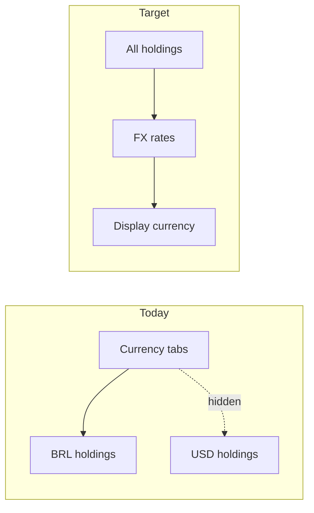
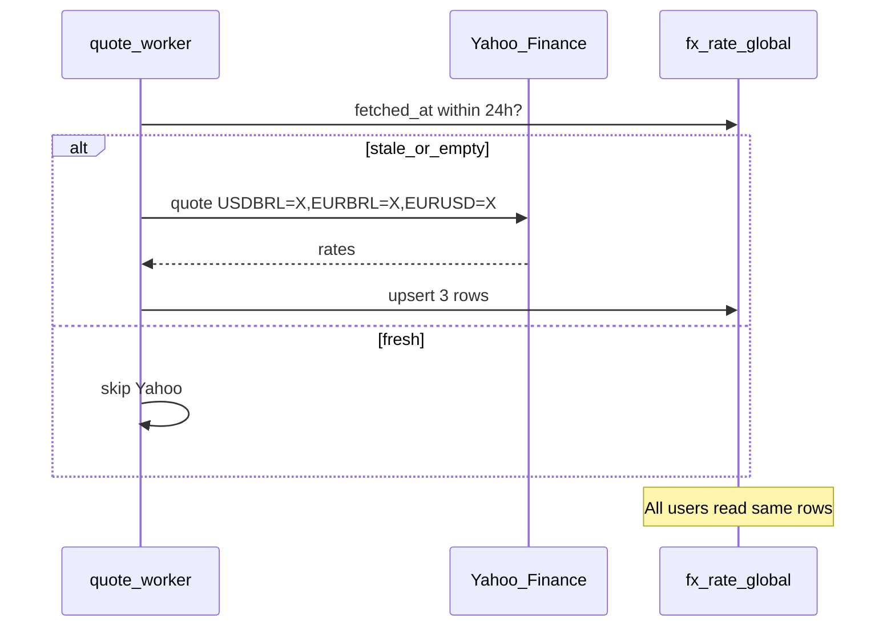

# Currency conversion for portfolio views

## Current state (what you already have)

- **Recording in original currency** is done: [`portfolio_holding.currency`](src/db/schema.ts) is required on upsert ([`upsertPortfolioHoldingFn`](src/lib/investment-server.ts)); create/edit UI offers `BRL | USD | EUR` in [`holdings.tsx`](src/routes/portfolio/holdings.tsx).
- **No conversion today**: [`loadPortfolioOverviewFn`](src/lib/investment-server.ts) and [`listPortfolioHoldingsFn`](src/lib/investment-server.ts) **filter** holdings where `currency === selected` (lines ~1254–1257, ~1047–1071). Holdings in other currencies are hidden, not converted.
- UI copy explicitly says *“Sem conversão cambial”* on [`portfolio.tsx`](src/routes/portfolio.tsx) and holdings.
- **Scoring routes** (`/dashboard`, `/investimentos`, pontuação) use integer points only — **out of scope** unless you later want money there.



---

## Product model: two complementary views

| View | Purpose | Where | Totals |
|------|---------|-------|--------|
| **Consolidated (converted)** | “What is my whole portfolio worth in BRL?” | `/portfolio`, `/portfolio/holdings` | Sum **all** holdings after FX → **display currency** |
| **Native breakdown** | “How much do I have in each currency, without mixing?” | New section on `/portfolio` (recommended) | One sub-total **per holding currency**, no cross-rate math |

**Default recommendation** (confirm or change before build):

- **Converted**: main experience on overview + holdings table (replace current filter-with-tabs behavior).
- **Native-only**: a **“Por moeda”** block on `/portfolio` (summary cards + mini allocation per currency), not a separate route — keeps one place for “health of the wallet” vs “breakdown by denomination”.

Scoring screens unchanged.

---

## FX rates — Yahoo Finance (confirmed)

**Yes — use the same stack you already have for market quotes.**

Yahoo lists FX as tickers in the form **`{BASE}{QUOTE}=X`** (e.g. `USDBRL=X`, `EURBRL=X`, `EURUSD=X`). The `regularMarketPrice` from `yahoo-finance2`’s `quote()` is the spot rate (e.g. `USDBRL=X` ≈ BRL per 1 USD). Reuse [`yfinanceProvider`](src/lib/market-data/providers/yfinance.ts) batching/logging; add a thin FX layer on top.

**Phase A (MVP) — global cache, one Yahoo pull per day**

Same idea as [`market_quote`](src/db/schema.ts): **one shared row set for the whole app**, no `user_id`, all users read the same rates.

| | `market_quote` | `fx_rate` (new) |
|--|----------------|-----------------|
| Scope | Global | Global |
| Key | `symbol` (e.g. `PETR4`) | `(base_currency, quote_currency)` e.g. `USD`→`BRL` |
| Written by | Quote worker | Quote worker (FX step) |
| Read by | Portfolio server fns | Portfolio server fns + `src/lib/fx` |
| Yahoo calls | Per symbol batch | **Fixed small set**, **≤1 batch/day** in MVP |

- **MVP refresh policy**: worker refreshes FX **at most once per 24 hours** (check `fetched_at` on any row or a single “last FX refresh” timestamp). If fresh enough → **skip Yahoo entirely**. Later: shorten interval via env (e.g. `FX_REFRESH_HOURS=1`).
- **Request path never hits Yahoo**: `loadPortfolioOverviewFn` / `listPortfolioHoldingsFn` only **SELECT from `fx_rate`**. No per-user, no on-demand provider calls (avoids N×users hammering Yahoo).
- **Yahoo fetch** (`src/lib/market-data/fx-yahoo.ts`): one batched `quote()` for MVP symbols `USDBRL=X`, `EURBRL=X`, `EURUSD=X` → upsert 3 rows (derive inverses in code: `1/rate`).
- **Conversion math**: `amountInDisplay = amountNative * rate(native → display)`; direct pair from table, else triangulation via BRL.
- **Stale/missing**: use last DB rate if Yahoo fails; UI shows `fxAsOf` + stale badge if older than 24h; partial converted total if a pair is missing.

**Caveats (document in UI footnote)**

- Yahoo Finance is **unofficial** (no SLA); you already handle Yahoo failures for equities ([`quote-refresh.ts`](src/lib/market-data/quote-refresh.ts)). FX refresh should log failures and fall back to last cached DB rate.
- Rate is **spot / intraday**, not historical cost FX.

**Phase B (optional later)**

- Increase refresh frequency (`FX_REFRESH_HOURS`).
- Manual override per pair in settings (if Yahoo is down for extended periods).
- User **default display currency** in DB.

**Not in scope initially**: historical cost-basis FX, crypto pairs beyond Yahoo coverage.

---

## Data layer

### New table: `fx_rate` (mirror of `market_quote` pattern)

```ts
// src/db/schema.ts — global, no user_id (like market_quote)
export const fxRate = pgTable(
  'fx_rate',
  {
    baseCurrency: text('base_currency').notNull(),   // 'USD'
    quoteCurrency: text('quote_currency').notNull(), // 'BRL'
    provider: text('provider').notNull(),          // 'yfinance'
    yahooSymbol: text('yahoo_symbol').notNull(),   // 'USDBRL=X' (audit/debug)
    rate: numeric('rate', { precision: 24, scale: 8 }).notNull(),
    asOf: timestamp('as_of', { withTimezone: true }),
    fetchedAt: timestamp('fetched_at', { withTimezone: true }).notNull().defaultNow(),
  },
  (t) => [primaryKey({ columns: [t.baseCurrency, t.quoteCurrency] })],
)
```

- Migration in new Drizzle file (after `0002_cute_rhino.sql`).
- Optional: store identity pairs (`BRL`→`BRL` = 1) in DB or treat in `convertMoney` without a row.
- **Not** reusing `market_quote` for FX symbols — keeps equity quotes and FX pairs separate and typed, but same operational model (worker write, app read).

### Optional: user preference

Add to [`user_allocation_profile`](src/db/schema.ts) or small `user_settings` row:

- `preferredDisplayCurrency: text | null` (default `BRL` if unset)

Until then, persist display currency in `localStorage` (same pattern as theme) and migrate to DB when preference table exists.

---

## Server / domain layer

### New modules

**`src/lib/market-data/fx-yahoo.ts`** (provider IO)

- Map currency codes ↔ Yahoo symbols; batch-fetch; map `QuoteFetchResult` → `{ base, quote, rate, asOf }`.

**`src/lib/fx/`** (pure domain)

- `loadFxRatesFromDb(db)` — load all rows (or needed pairs) for `BRL|USD|EUR`; used by portfolio server fns.
- `convertMoney(amount, from, to, rates)` — unit-tested; identity + inverse derivation.
- `buildRateMatrix(currencies, rates)` — triangulation via BRL.

**`src/lib/market-data/fx-refresh.ts`** (worker-only IO)

- `refreshFxRatesIfStale(db)` — if oldest `fetched_at` < 24h ago, return early; else Yahoo batch + upsert. **Only called from quote worker**, not from user-facing server fns.

### Refactor holding valuation (avoid duplication)

Extract shared logic from [`loadPortfolioOverviewFn`](src/lib/investment-server.ts) and [`listPortfolioHoldingsFn`](src/lib/investment-server.ts) into something like `src/lib/portfolio-valuation.ts`:

- Input: holdings rows + quotes map.
- Output per holding: `{ nativeCurrency, marketValueNative, avgCostNative, unrealizedPlNative, ... }`.

Then two consumers:

1. **Consolidated** — map each holding through `convertMoney`, aggregate `marketValueDisplay`, `unrealizedPlDisplay`, allocation % by type in display currency.
2. **Native breakdown** — `groupBy(holding.currency)` and sum native MV only.

### API changes

| Function | Change |
|----------|--------|
| `loadPortfolioOverviewFn` | Input: `displayCurrency` (required when holdings exist). Return: converted totals + `allocation` in display currency + new `byNativeCurrency[]` for breakdown section + `fxAsOf`, `fxStale`, `fxMissingPairs[]`. |
| `listPortfolioHoldingsFn` | Input: `displayCurrency`. Return **all** holdings; each row adds `marketValueNative`, `marketValueDisplay`, `currency` (native), `fxRateUsed?`, `fxUnavailable?`. Remove SQL filter on `portfolio_holding.currency`. |
| `listPortfolioCurrenciesFn` | Keep for native breakdown labels; optionally rename conceptually to “currencies present in portfolio”. |
| `refreshFxRatesIfStale` (internal) | Worker-only: ≤1 Yahoo batch/day, upsert global `fx_rate`. Optional admin `refreshFxRatesFn` for manual/debug only. |

**Allocation targets** ([`user_allocation_profile`](src/db/schema.ts)): drift/suggestions stay **percentage-based**; numerators/denominators use **converted** market values so a USD position counts toward type % in the display currency you chose.

---

## UI changes

### `/portfolio` ([`portfolio.tsx`](src/routes/portfolio.tsx))

- Replace currency **filter tabs** with **display currency** selector (all supported codes, not only currencies already in portfolio).
- Update subtitle: explain converted totals + link/anchor to “Por moeda” section.
- Summary cards ([`portfolio-summary-cards.tsx`](src/components/portfolio/portfolio-summary-cards.tsx)): use `displayCurrency` + show `fxAsOf` footnote.
- **New “Por moeda” section**: one card per native currency (total MV, % of portfolio in native terms, holding count). No conversion between cards.
- Allocation / drift / suggestions components: consume converted `marketValue` from overview payload.

### `/portfolio/holdings` ([`holdings.tsx`](src/routes/portfolio/holdings.tsx))

- Same **display currency** control (shared hook e.g. `useDisplayCurrency()`).
- Table columns:
  - **Valor (moeda do ativo)** — native `fmtMoney(..., row.currency)`.
  - **Valor (exibição)** — `fmtMoney(..., displayCurrency)` when rate available; else `—`.
- Page total and donut: **converted** sums.
- Form unchanged: user still picks **native** currency when recording ([`HOLDING_CURRENCY_OPTIONS`](src/routes/portfolio/holdings.tsx)).
- Remove copy “Sem conversão cambial automática” where misleading; add short note that recording is always in asset currency.

### Formatting

- Centralize on [`src/components/portfolio/format.ts`](src/components/portfolio/format.ts); remove duplicate `fmtMoney` in `holdings.tsx`.

### i18n

- Add strings to [`src/messages/pt-BR`](src/messages/pt-BR/) for new labels, FX stale warnings, partial totals.

---

## Worker / ops



- Extend [`quote-worker.ts`](src/scripts/quote-worker.ts): after equity quotes, call `refreshFxRatesIfStale()` — **fixed 3 symbols**, **not** derived from per-user holdings (keeps request count minimal).
- **MVP**: `FX_REFRESH_HOURS=24` (default). Post-MVP: lower to 1–4h without code changes.
- **No new API key**; reuses `yahoo-finance2`.
- Footnote in UI: “Câmbio: Yahoo Finance, atualizado em {fxAsOf} (atualização diária)”.

---

## Edge cases (implement explicitly)

| Case | Behavior |
|------|----------|
| Display currency = holding currency | Rate 1; no FX row needed |
| Missing quote for ticker | Row excluded from MV (today’s behavior); converted total respects same rule |
| Fixed income | Book value in native currency, then convert |
| Quote currency ≠ holding currency | Trust **holding.currency** for book/position; quote currency informational only (today’s model) |
| Single-currency portfolio | Conversion still works; breakdown section shows one card |
| New currency in form not in FX table | Block conversion with clear error; allow native-only display |

---

## Testing

- Unit tests: `convertMoney`, triangulation, matrix gaps.
- Server integration: overview with mixed BRL+USD holdings → totals match hand-calculated converted sum.
- UI smoke: switch display currency updates cards + table without losing rows.

---

## Implementation order

1. Schema + `fx-yahoo` fetch + `fx` lib + worker refresh
2. `portfolio-valuation` extract + unit tests
3. `loadPortfolioOverviewFn` + `listPortfolioHoldingsFn` (converted + `byNativeCurrency`)
4. Shared `useDisplayCurrency` + `/portfolio` UI
5. Holdings table dual columns + totals
6. Copy/i18n + remove obsolete “sem conversão” messaging
7. Optional: persist `preferredDisplayCurrency` in DB

---

## Open decisions (please confirm when you approve the plan)

1. **Native breakdown placement**: default = section on `/portfolio` only (not a new route). OK?
2. **FX source**: **Yahoo Finance via `yahoo-finance2`** — confirmed.
3. **Default display currency**: `BRL` for pt-BR product unless user picks another — OK?

If you prefer a **dedicated `/portfolio/por-moeda` route** or **manual rate overrides in v1**, say so before implementation.
