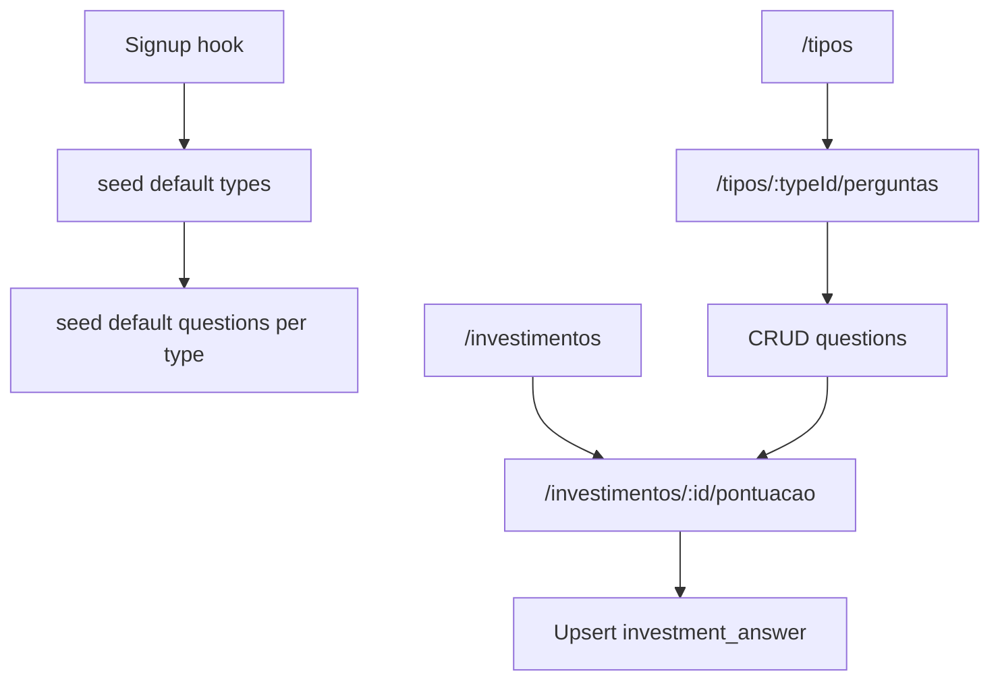

# Plan: Default questions, manage-per-type UI, scoring screen

## What this plan covers (your three asks)

| Pedido | Incluído? | Onde |
|--------|-----------|------|
| **Gerir as minhas perguntas** — adicionar, editar, **remover** (incluindo as seeded) | Sim | [`src/routes/tipos/$typeId/perguntas.tsx`](src/routes/tipos/$typeId/perguntas.tsx): as defaults são **linhas normais** na tabela `question`; podes **desativar**, **editar texto/ordem**, **apagar** se não houver respostas em investimentos ([`AGENTS.md`](../AGENTS.md): com respostas, apagar é bloqueado — usar `active = false`). O seed só cria cópias por `userId`. |
| **Pontuar investimentos Sim/Não** com base nas perguntas ativas do tipo | Sim | [`src/routes/investimentos/$id/pontuacao.tsx`](src/routes/investimentos/$id/pontuacao.tsx): +1 / −1 / não respondida = 0; plano inclui alinhar controlo à UI “Sim/Não” do mock. |
| **Dashboard: melhores 3 por tipo** | Planeado | [`src/routes/dashboard.tsx`](src/routes/dashboard.tsx) hoje só tem contagens + links; ver **§4** + todo `dashboard-top-per-type`. |

---

## Current baseline (already in repo)

- **Schema**: [`src/db/schema.ts`](../src/db/schema.ts) — `question` rows are scoped by `user_id` and `investment_type_id`, with `prompt`, `sort_order`, `active`.
- **Signup seed**: [`src/db/seed-default-types.ts`](../src/db/seed-default-types.ts) inserts only the seven default **type names** (pt-BR). [`src/lib/auth.ts`](../src/lib/auth.ts) calls this after user creation. **No questions are inserted yet.**
- **Manage questions per type**: [`src/routes/tipos/$typeId/perguntas.tsx`](../src/routes/tipos/$typeId/perguntas.tsx) — full create / inline edit (prompt, order, active) / delete with `HAS_ANSWERS` guard; matches domain rules in [`AGENTS.md`](../AGENTS.md).
- **Score investment**: [`src/routes/investimentos/$id/pontuacao.tsx`](../src/routes/investimentos/$id/pontuacao.tsx) — loads active questions via `loadInvestmentScoringFn`, persists with `saveInvestmentScoringFn` in [`src/lib/investment-server.ts`](../src/lib/investment-server.ts), live total (+1 / −1 / unanswered = 0).

Design references: [`design/perguntas_por_tipo/code.html`](../design/perguntas_por_tipo/code.html), [`design/pontuaco_do_investimento/code.html`](../design/pontuaco_do_investimento/code.html), plus [`DESIGN.md`](../DESIGN.md) for toggles and tables.

---

## 1. Default “common questions” for new users

**Goal**: After first-time type seed, each default type gets a sensible set of **yes/no** prompts (pt-BR), so a new user can create an investment and score it immediately.

**Implementation approach**

- Add a **single source of truth** module (e.g. [`src/db/default-question-bank.ts`](../src/db/default-question-bank.ts)) that exports:
  - A map keyed by **exact type name** (same strings as `DEFAULT_TYPE_NAMES` in [`seed-default-types.ts`](../src/db/seed-default-types.ts)).
  - Values: ordered arrays of question strings (implicitly yes/no; copy should read naturally as Sim/Não).
- Extend the seed flow in [`seed-default-types.ts`](../src/db/seed-default-types.ts) (or split into `seed-defaults-for-user.ts` if cleaner):
  1. Keep the existing guard: if the user already has any `investment_type`, **do not** re-run type insert (preserves current idempotency).
  2. After inserting types, use **`.returning()`** on the insert (or a follow-up `select`) to get `(id, name)` pairs.
  3. For each row whose `name` exists in the question bank, `insert` into `question` with `userId`, `investmentTypeId`, `prompt`, `sortOrder` (0..n−1), `active: true`.
- **Idempotency for questions**: Because types are only created when the user had zero types, this runs **once per user** at signup — no duplicate question rows if the hook runs twice after types already exist (guard still holds).

**Question content (authoritative copy for implementation)**

Use **the same ordered list** for both type names where noted. Keys must match **exactly** the seeded type names in [`seed-default-types.ts`](../src/db/seed-default-types.ts): `Ações`, `Ações internacionais`, `FIIs`, `REITs`.

*Implementation detail*: export e.g. `DEFAULT_QUESTIONS_ACOES` and reference it for both `Ações` and `Ações internacionais`; same for `DEFAULT_QUESTIONS_IMOVEIS_LISTADOS` (or similar) for `FIIs` and `REITs`.

### Pack: `Ações` e `Ações internacionais` (12 perguntas)

1. ROE historicamente maior que 5%? (Considere anos anteriores).
2. Tem um crescimento de receitas (Ou lucro) superior a 5% nos últimos 5 anos?
3. A empresa tem um histórico de pagamento de dividendos?
4. A empresa investe amplamente em pesquisa e inovação? Setor Obsoleto = SEMPRE NÃO
5. Tem mais de 30 anos de mercado? (Fundação)
6. É líder nacional ou mundial no setor em que atua? (Só considera se for LÍDER, primeira colocada)
7. O setor em que a empresa atua tem mais de 100 anos?
8. A empresa é uma BLUE CHIP?
9. A empresa tem uma boa gestão? Histórico de corrupção = SEMPRE NÃO
10. É livre de controle ESTATAL ou concentração em cliente único?
11. Div. Líquida/EBITDA é menor que 2 nos últimos 5 anos?
12. Bom Dividend yield

### Pack: `FIIs` e `REITs` (11 perguntas)

1. Os imóveis desse Fundo Imobiliário estão localizados em regiões nobres?
2. As propriedades são novas e não consomem manutenção excessiva?
3. O fundo imobiliário está negociado abaixo do P/VP 1? (Acima de 1,5, eu descarto o investimento em qualquer hipótese)
4. Distribui dividendos a mais de 4 anos consistentemente?
5. Não é dependente de um único inquilino ou imóvel?
6. O Yield está dentro ou acima da média para fundos imobiliários do mesmo tipo?
7. VPA vs Valor da cota, VPA maior que valor da cota *(plan note: user text had “VAP”; use **VPA** consistently.)*
8. Taxa de administração: perto ou abaixo de 1
9. Patrimônio Líquido subindo nos ultimos 10 (ou 5) anos
10. Alavancagem financeira: mais baixa possivel - menor de 10% ou pouco acima disso
11. Fundo Tijolo:Vacancia zero ou perto de zero *(plan note: normalize spacing/capitalization in code, e.g. “Fundo tijolo: vacância zero ou perto de zero”, if you standardize typography.)*

**Suggested starter packs — `Renda fixa`, `Cripto`, `Reserva de valor`**

These are **recommended defaults** (4 perguntas cada, estilo Sim/Não) to fill the gap until you replace them with your own wording. Treat as editable copy, not financial advice.

### Pack: `Renda fixa` (4 perguntas)

1. O emissor (ou título soberano) e o prazo do título são compatíveis com o risco de crédito e o horizonte que você aceita?
2. A liquidez e o vencimento permitem atender necessidades de caixa sem depender de resgate prematuro indesejado?
3. A remuneração (CDI, IPCA+, prefixada) e eventuais taxas estão claras **antes** de investir?
4. Há proteção ou lastro adequados ao produto (ex.: limites do FGC quando aplicável, ou garantias em debêntures)?

### Pack: `Cripto` (4 perguntas)

1. Você compreende e aceita volatilidade alta e riscos regulatórios e operacionais deste ativo?
2. Consegue explicar, em linhas gerais, **por que** este ativo ou protocolo faz parte da sua estratégia (além de especulação de curto prazo)?
3. A posição respeita um **limite de patrimônio** que você definiu para exposição de alto risco?
4. Custódia e acesso estão razoavelmente seguros (exchange/carteira confiáveis, 2FA, backup de credenciais)?

### Pack: `Reserva de valor` (4 perguntas)

1. O instrumento tende a preservar poder de compra ou papel de proteção nos cenários para os quais você o reserva?
2. Custos de aquisição, custódia e impostos são aceitáveis para um ativo de **reserva**, não de trading?
3. Você evita concentração excessiva num único formato de reserva (ex.: uma única moeda, um único metal, um único emissor)?
4. Consegue converter em caixa ou equivalente líquido no prazo que uma urgência exigiria?

Keep each prompt under the existing 2000-char limit; all are user-editable after seed.

**“Restaurar perguntas padrão” (merge, sem duplicar)**

- **UI**: Botão na página [`src/routes/tipos/$typeId/perguntas.tsx`](../src/routes/tipos/$typeId/perguntas.tsx) (ex.: secção de ações acima da tabela): **“Restaurar perguntas padrão”**. Ocultar ou desativar se o **nome** do tipo não existir no question bank (tipos criados pelo utilizador com nome arbitrário).
- **Server function** (ex. `restoreDefaultQuestionsForTypeFn`):
  1. Autenticado; confirmar que o `typeId` pertence ao utilizador; ler `investment_type.name`.
  2. Resolver o pack pelo nome (igual ao seed: `Ações` / `Ações internacionais` / etc.).
  3. Carregar perguntas actuais deste tipo; construir conjunto de `prompt` **normalizados para comparação** (`trim`; opcionalmente colapsar espaços múltiplos interiores para evitar duplicados “só por espaços”).
  4. Para cada string do pack **na ordem do banco**, se **não** existir já uma pergunta com o mesmo texto (após a mesma normalização), `insert` com `sort_order` incremental (ex.: `max(sort_order)+1` por inserção, ou um batch com ordem seguinte).
  5. **Não** remover nem sobrescrever perguntas existentes; **não** duplicar prompts já presentes (mesmo que inactivas — se o texto coincide, não inserir outra linha).
  6. Resposta: contagem de linhas inseridas (para toast “Nada a restaurar” vs “Adicionadas N perguntas”).

Isto cobre: utilizadores antigos sem seed de perguntas; utilizadores que apagaram parte das defaults; e reintrodução de itens em falta sem copiar o que já editaram (se editaram o texto, o default «em bruto» volta como **nova** linha — aceitável; documentar na UX curta opcional).

---

## 2. Screens: manage questions per investment type

**Status**: Core functionality is done in [`src/routes/tipos/$typeId/perguntas.tsx`](../src/routes/tipos/$typeId/perguntas.tsx).

**Planned polish (scope only what’s still out of sync with spec)**

- **Restaurar padrões**: Botão **“Restaurar perguntas padrão”** conforme secção anterior; mensagem clara quando o tipo não tem pack.
- **Design alignment** ([`design/perguntas_por_tipo/code.html`](../design/perguntas_por_tipo/code.html)): verify breadcrumbs, table rhythm (`fa-table`), primary actions, and iconography vs mock; no new routes required.
- **Plan doc vs code**: MVP plan mentioned TanStack Form for this screen — current implementation uses controlled state; only refactor if you want consistency across all CRUD forms (not required for behavior).

Navigation entry: ensure [`src/routes/tipos.tsx`](../src/routes/tipos.tsx) keeps **Gerir perguntas** linking to `/tipos/$typeId/perguntas` (verify if already present).

---

## 3. Screen: score investment from type’s questions

**Status**: Implemented in [`src/routes/investimentos/$id/pontuacao.tsx`](../src/routes/investimentos/$id/pontuacao.tsx); server logic in `loadInvestmentScoringFn` / `saveInvestmentScoringFn` in [`src/lib/investment-server.ts`](../src/lib/investment-server.ts).

**Planned polish**

- **`DESIGN.md` / mock**: Prefer **Sim/Não** control consistent with design — today the screen uses a **three-way `Select`** (unanswered / no / yes). Consider replacing the select with a **segmented control or paired Switch + explicit “Limpar resposta”** so unanswered remains first-class and the UI matches [`design/pontuaco_do_investimento/code.html`](../design/pontuaco_do_investimento/code.html) (track `surface-container-highest`; Yes = `primary`).
- **Copy**: Keep legend “Sim = +1 · Não = −1 · Não respondida = 0” visible; ensure inactive questions stay excluded (already true server-side).
- **Zero active questions**: Existing link to gerir perguntas is correct; optionally surface total “answered / active” if you add it to the loader later (list screen may already show this — verify [`src/routes/investimentos.tsx`](../src/routes/investimentos.tsx) if needed).

---

## 4. Dashboard: destaques — melhores **3** investimentos **por tipo**

**Goal**: No `/dashboard`, além do resumo atual, mostrar por cada tipo de investimento do utilizador até **3** linhas (**fixo: top 3**) com os activos **melhor pontuados naquele tipo** — nunca comparar pontuações entre tipos diferentes.

**Regras** (iguais ao ranking em `listInvestmentsOverviewFn` in [`src/lib/investment-server.ts`](../src/lib/investment-server.ts)):

- Pontos = soma só sobre **perguntas ativas** **respondidas** (Sim +1, Não −1).
- Ordenação **dentro do tipo**: `score` descendente, desempate por **nome** ascendente.
- Tipos **sem** investimentos: omitir secção ou mostrar linha “Sem investimentos”.
- Cada linha: nome, pontuação, link para [`src/routes/investimentos/$id/pontuacao.tsx`](../src/routes/investimentos/$id/pontuacao.tsx) (e/ou para lista filtrada).

**Implementação sugerida**

- Nova server function (ou extensão de `getDashboardSummaryFn`) que devolve algo como: lista de tipos ordenados (ex. `sort_order`), cada um com `{ typeName, investments: [{ id, name, score }] }` truncada ao **top 3** (constante no código).
- Reutilizar a mesma lógica de pontuação que `listInvestmentsOverviewFn` (extrair helper partilhado se reduzir duplicação).
- UI em [`src/routes/dashboard.tsx`](../src/routes/dashboard.tsx): secção abaixo dos cartões ou em substituição parcial do bloco “placeholder” (`query_stats`), agrupada por tipo, alinhada a [`design/dashboard/code.html`](../design/dashboard/code.html) quando fizer sentido.

---

## 5. Testing and acceptance

- New signup (or test user with empty DB): user receives 7 types **and** seeded questions — **12** each on **`Ações`** and **`Ações internacionais`**, **11** each on **`FIIs`** and **`REITs`** (user-authored copy in this plan), **4** each on **`Renda fixa`**, **`Cripto`**, **`Reserva de valor`** (assistant-suggested starters; revise if needed).
- [`/tipos/$typeId/perguntas`](../src/routes/tipos/$typeId/perguntas.tsx): create, edit order, toggle inactive; delete blocked when answers exist; **Restaurar perguntas padrão** only inserts prompts absent by trimmed-text match; no duplicates.
- [`/investimentos/$id/pontuacao`](../src/routes/investimentos/$id/pontuacao.tsx): totals match server after save; inactive questions do not appear.
- **Dashboard**: para cada tipo com investimentos, exactamente os **3** primeiros por pontuação (regras de desempate iguais à lista); tipos sem dados não quebram a página.

---

## Files likely touched

| Area | Files |
|------|--------|
| Question bank + seed | New `src/db/default-question-bank.ts`; extend [`src/db/seed-default-types.ts`](../src/db/seed-default-types.ts) |
| Restaurar padrões | [`src/lib/investment-server.ts`](../src/lib/investment-server.ts), [`src/routes/tipos/$typeId/perguntas.tsx`](../src/routes/tipos/$typeId/perguntas.tsx) |
| Scoring UI | [`src/routes/investimentos/$id/pontuacao.tsx`](../src/routes/investimentos/$id/pontuacao.tsx) |
| Navigation check | [`src/routes/tipos.tsx`](../src/routes/tipos.tsx) |
| Dashboard top picks | [`src/lib/investment-server.ts`](../src/lib/investment-server.ts), [`src/routes/dashboard.tsx`](../src/routes/dashboard.tsx) |

No DB migration is required if the `question` table already matches production schema; seed only inserts rows.
