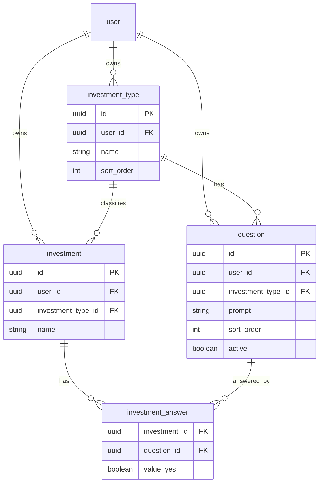
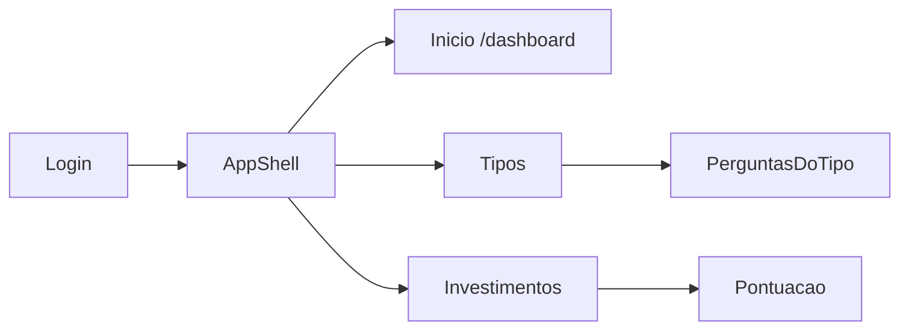

# Plano: MVP de pontuação (TanStack Start)

## Contexto

O repositório inclui o produto descrito em `[plan.md](C:\Users\allan\projects\investiments-analisys\plan.md)`, a especificação visual em `[DESIGN.md](C:\Users\allan\projects\investiments-analisys\DESIGN.md)` e mocks HTML estáticos em `[design/](C:\Users\allan\projects\investiments-analisys\design)`. O escopo **desta fase** é: tipos de investimento, perguntas por tipo (CRUD), e **investimentos avaliados** com respostas Sim/Não que geram pontuação e ranking. Metas percentuais, carteira com valor/quantidade e “investimentos desejados” ficam para depois.

## Arquitetura de dados

- **Pontuação**: para cada pergunta ativa respondida, `Sim => +1`, `Não => -1`; total = soma. Perguntas sem resposta tratadas como **0** (não somam) — comportamento explícito na UI (“não respondida”).
- **Ranking**: ordenar investimentos **dentro do mesmo tipo** por total decrescente; desempate opcional por nome (alfabético).

Todas as tabelas de domínio com `user_id` para isolamento multiusuário (alinhado ao Better Auth).

## Stack e scaffolding

1. **Criar projeto**: `pnpm create @tanstack/start@latest` na **raiz do repositório** (o código da app convive com `DESIGN.md`, `design/`, `plans/`, etc. no mesmo repo; não usar subpasta `apps/web`). Opções típicas: React, TypeScript, Tailwind (necessário para shadcn), adapter Nitro quando oferecido.
2. **PostgreSQL**: variável `DATABASE_URL`; desenvolvimento local via Docker ou serviço gerenciado (Neon etc.).
3. **Drizzle**: `drizzle.config.ts`, cliente em algo como `[src/db/index.ts](src/db/index.ts)`, migrations ou `drizzle-kit push` conforme preferência da equipe.
4. **Better Auth**: seguir [documentação oficial](https://www.better-auth.com/docs) com adapter Drizzle; tabelas de sessão/usuário geradas ou copiadas do exemplo recomendado; expor rota `/api/auth/*` compatível com o handler do Start.
5. **shadcn/ui**: `pnpm dlx shadcn@latest init` (ou equivalente com pnpm) no projeto Vite/Start existente; componentes base usados no MVP: `Button`, `Input`, `Label`, `Switch` (toggle Sim/Não), `Table`, `Dialog`, `DropdownMenu`, `Card`, `toast`/`sonner` se necessário. **Tema**: alinhar variáveis CSS / `tailwind.config` com `[DESIGN.md](C:\Users\allan\projects\investiments-analisys\DESIGN.md)` (ver secção seguinte); suportar **tema claro e escuro** (variáveis CSS ou `class` no `html`).

### Auth e deploy (decisões fechadas)

- **Login**: Better Auth com **email/password** e **Google**; UI como `[design/login/code.html](C:\Users\allan\projects\investiments-analisys\design\login\code.html)` onde aplicável.
- **Produção**: **Docker / VPS** — imagem Node com artefacto de build do TanStack Start; Postgres com string de ligação segura; variáveis: `DATABASE_URL`, segredos Better Auth, **Google OAuth** (`client id` / `secret`), URL pública da app para callbacks. Incluir no repositório um `docker-compose` de desenvolvimento (app + Postgres) quando o scaffolding existir.

## Design system: DESIGN.md e pasta `design/`

### Autoridade e north star

- **Documento normativo**: `[DESIGN.md](C:\Users\allan\projects\investiments-analisys\DESIGN.md)` define o produto **The Financial Architect** com north star **“The High-Fidelity Ledger”**: experiência editorial, **Organic Asymmetry**, **Tonal Depth**, separação por **camadas de superfície** (sem grelha “SaaS default”).
- **Regra “No-Line”**: não usar bordas sólidas 1px para secções; separar com mudança de cor de fundo (`surface` → `surface-container-low` → `surface-container-lowest`). Bordas só onde a acessibilidade exige (inputs): `outline_variant` a **20% opacidade**, nunca 100%.
- **Vidro / topo fixo**: navegação ou elementos flutuantes — superfície branca ~80% opacidade + `backdrop-filter: blur(12px)` (equivalente à classe `.glass-effect` nos mocks).
- **Tipografia**: **Manrope** para display/headlines; **Inter** para título de interface, corpo e labels. Contraste editorial: métricas grandes + descritores pequenos em `on_surface_variant`.
- **Elevação**: evitar sombras em cartões estáticos; empilhar `surface-container-lowest` sobre `surface-container-low`. Sombra “ambiente” só para elementos que flutuam: `0px 12px 32px -4px rgba(25, 28, 30, 0.06)`.
- **Tabelas**: **sem linhas horizontais** entre linhas; espaçamento vertical (~`0.5rem`) entre linhas; hover com fundo` surface-container-low`muito subtil; cabeçalhos estilo`label`em`outline`, **maiúsculas**.
- **Sim/Não**: trilho `surface-container-highest`; estado **Sim** com `primary` (#000000); **Não** com `surface-variant`. Botões primários: `primary_container` + texto `on_primary`; botões de êxito/terciário: `tertiary_container` + texto `tertiary_fixed`.
- **Links**: não usar azul hyperlink genérico; usar `primary` com sublinhado `surface_tint` (ver DESIGN.md).
- **Breadcrumbs**: `body-sm`, separador `**/`** em `surface-dim` (não setas).

### Tokens Tailwind nos mocks HTML

Cada mock em `design/*/code.html` repete um bloco `tailwind.config.theme.extend.colors` com tokens nomeados em kebab-case Tailwind (ex.: `surface-container-low`, `on-surface`, `primary`, `tertiary-fixed-dim`). **Na implementação**, centralizar estes valores num único `tailwind.config` (e mapear para variáveis shadcn onde fizer sentido) em vez de copiar literais espalhados.

### Mapa mocks → telas do plano

| Tela (rota)           | Referência HTML estática                                                                                                                               |
| --------------------- | ------------------------------------------------------------------------------------------------------------------------------------------------------ |
| Login                 | `[design/login/code.html](C:\Users\allan\projects\investiments-analisys\design\login\code.html)`                                                       |
| Início / dashboard    | `[design/dashboard/code.html](C:\Users\allan\projects\investiments-analisys\design\dashboard\code.html)`                                               |
| Tipos de investimento | `[design/tipos_de_investimento/code.html](C:\Users\allan\projects\investiments-analisys\design\tipos_de_investimento\code.html)`                       |
| Perguntas por tipo    | `[design/perguntas_por_tipo/code.html](C:\Users\allan\projects\investiments-analisys\design\perguntas_por_tipo\code.html)`                             |
| Lista + ranking       | `[design/lista_de_investimentos_e_ranking/code.html](C:\Users\allan\projects\investiments-analisys\design\lista_de_investimentos_e_ranking\code.html)` |
| Pontuação (Sim/Não)   | `[design/pontua_o_do_investimento/code.html](C:\Users\allan\projects\investiments-analisys\design\pontua_o_do_investimento\code.html)`                 |

### Notas de implementação

- Os mocks usam **Material Symbols Outlined** (CDN Google) para ícones da navegação e ações; replicar com a mesma família ou equivalente (Lucide só se mantiver peso visual semelhante — preferir consistência com o mock).
- Alguns mocks misturam classes `slate-*` com tokens `surface-*`; em caso de conflito, **priorizar semântica e valores de `[DESIGN.md](C:\Users\allan\projects\investiments-analisys\DESIGN.md)`** e os tokens do `extend.colors` dos HTML.
- **Marca**: cópia “The Financial Architect” / “Financial Architect” + subtítulo “Premium Ledger” — alinhar títulos e meta com o mock correspondente à rota.
- **Cursor**: regra do projeto em `[.agents/rules/financial-architect-design.mdc](C:\Users\allan\projects\investiments-analisys\.cursor\rules\financial-architect-design.mdc)` (`alwaysApply: true`); resumo em `[AGENTS.md](C:\Users\allan\projects\investiments-analisys\AGENTS.md)`. Ao implementar UI, ler `DESIGN.md` + o `code.html` da tela em `design/`.

## Camada de aplicativo (TanStack)

- **Router**: rotas em arquivo sob o padrão do Start (ex.: `routes/...`), layouts com outlet para navegação entre Tipos, Perguntas e Investimentos.
- **Server functions**: `[createServerFn](https://tanstack.com/start/latest/docs/framework/react/guide/databases)` do `@tanstack/react-start` para leituras/escritas no Postgres via Drizzle; em cada handler, resolver **sessão** (Better Auth) e retornar 401 se não autenticado.
- **TanStack Form**: formulários de criação/edição de tipo, pergunta e investimento; formulário de pontuação como lista de toggles por pergunta (uma linha = uma pergunta ativa).
- **TanStack Table**: listagens de tipos, perguntas (filtradas por tipo) e investimentos com colunas: nome, tipo, **total de pontos**, talvez contagem de perguntas respondidas.

## Definição de telas (screens)

Visão geral de navegação (área autenticada):

### Shell da aplicação (layout autenticado)

- **Onde**: layout pai de todas as rotas após login (ex.: `_authenticated` ou equivalente no file routing do Start).
- **Conteúdo**: cabeçalho ou barra lateral com **Início** (`/dashboard`), **Tipos de investimento**, **Investimentos**; **nome do utilizador** ou avatar com **Sair** (Better Auth signOut).
- **Comportamento**: rotas filhas renderizam no `<Outlet />`; em mobile, navegação colapsável (sheet ou menu).
- **TanStack**: `Link` do router para navegação; estado de sessão vindo do servidor ou loader.

---

### Tela: Login (e cadastro, se habilitado)

- **Rota**: `/login` (ajustar ao path real do Better Auth / Start).
- **Objetivo**: autenticar o utilizador; redirecionar para **`/dashboard`** após sucesso (a rota `/` apenas redireciona para o dashboard — ver decisões).
- **Blocos de UI**: título, formulário (email/palavra-passe ou botões sociais conforme config), link “Criar conta” se existir fluxo de registo, mensagem de erro de auth.
- **Estados**: validação de campos; erro de credenciais; loading no submit.
- **Fora do escopo visual**: recuperação de palavra-passe (opcional, fase 2).

---

### Tela: Início (dashboard mínimo)

- **Rota**: **`/dashboard`**. A rota **`/`** faz **redirect** para `/dashboard` (entrada após login e bookmark canónico do “início”).
- **Objetivo**: ponto de entrada após login; atalhos para fluxos principais.
- **Blocos de UI**: cards ou lista de links: “Gerir tipos e perguntas”, “Ver investimentos e ranking”, contagem rápida opcional (n.º de tipos, investimentos).
- **Estados**: empty amigável se contadores zerados, com CTA para criar primeiro tipo ou investimento.

---

### Tela: Lista de tipos de investimento

- **Rota**: `/tipos`.
- **Objetivo**: CRUD de **investment types** (nome, ordem de exibição).
- **Blocos de UI**:
  - Título + botão **Novo tipo** (abre `Dialog` ou navega para `/tipos/novo`).
  - **Tabela** (TanStack Table): colunas Nome, Ordem, n.º de perguntas (opcional), ações.
  - Ações por linha: **Editar**, **Eliminar** (com confirmação), **Gerir perguntas** → `/tipos/$typeId/perguntas`.
- **Formulário criar/editar**: TanStack Form + `Input` (nome), controle de ordem (número ou drag-and-drop na fase 2).
- **Estados**: lista vazia com texto + botão criar; toast sucesso/erro; erro de servidor.

---

### Tela: Perguntas de um tipo

- **Rota**: `/tipos/$typeId/perguntas`.
- **Objetivo**: CRUD de perguntas **ligadas ao tipo**; texto, ordem, ativo/inativo.
- **Blocos de UI**:
  - **Breadcrumb**: Tipos → [Nome do tipo] → Perguntas.
  - Botão **Nova pergunta**.
  - **Tabela**: Texto (truncado), Ordem, Ativa (badge Sim/Não), ações Editar / Eliminar.
- **Formulário criar/editar**: TanStack Form — `Input` ou `Textarea` para enunciado, `Switch` para ativa, campo ordem.
- **Estados**: tipo inexistente (404); sem perguntas — empty state explicando que as perguntas alimentam a pontuação dos investimentos deste tipo.

---

### Tela: Lista de investimentos (com ranking)

- **Rota**: `/investimentos`.
- **Objetivo**: CRUD de investimentos avaliados; ver **pontuação total** e **posição relativa** dentro do mesmo tipo.
- **Blocos de UI**:
  - **Filtro** por tipo (select “Todos” + tipos do utilizador).
  - Botão **Novo investimento**.
  - **Tabela** (TanStack Table): Nome, Tipo, **Pontos totais**, **Respondidas / ativas** (ex.: `3/5`), **Posição no tipo** (1.º, 2.º… após ordenar por pontos desc., desempate nome), ações.
  - Ações: **Pontuar** → `/investimentos/$id/pontuacao`, Editar nome/tipo, Eliminar.
- **Comportamento de ranking**: com filtro **“Todos”**, a lista é **agrupada por tipo** (secção por `investment_type`: subtítulo ou cabeçalho de grupo). Em cada secção: ordenar por pontos (desc.), desempate por nome; coluna **Posição** = 1.º, 2.º… **apenas dentro desse tipo**. Com um único tipo selecionado no filtro, pode ser uma tabela flat com as mesmas regras (equivalente a um só grupo).
- **Estados**: vazio; sem tipos cadastrados — CTA para `/tipos`.

---

### Tela: Pontuação (respostas Sim/Não)

- **Rota**: `/investimentos/$id/pontuacao`.
- **Objetivo**: responder cada **pergunta ativa** do tipo do investimento com toggle; persistir respostas; mostrar **soma em tempo real** (+1 / −1 por pergunta respondida).
- **Blocos de UI**:
  - Cabeçalho: nome do investimento + tipo (read-only).
  - **Resumo**: “Total: **N** pontos”; subtítulo “Perguntas ativas: k”.
  - Lista: uma linha por pergunta ativa — enunciado, **Switch** ou segmento Sim/Não (legenda: Sim = +1, Não = −1).
  - Perguntas **inativas** após já terem resposta: mostrar só leitura ou ocultar (documentar: ocultar na edição; dados históricos na BD podem ficar para relatórios futuros).
  - Botões: **Guardar** (e opcional “Guardar e voltar”).
- **TanStack Form**: formulário controlado com array field ou um campo por `questionId`; submit chama server function que faz upsert em `investment_answer`.
- **Estados**: investimento sem tipo válido; tipo sem perguntas ativas — mensagem + link para gerir perguntas; loading ao guardar.

---

### Resumo rápido rotas ↔ telas

| Rota                           | Tela                                 |
| ------------------------------ | ------------------------------------ |
| `/login`                       | Login (e registo se aplicável)       |
| `/`                            | Redirect → `/dashboard`              |
| `/dashboard`                   | Início / atalhos                     |
| `/tipos`                       | Lista + CRUD tipos                   |
| `/tipos/$typeId/perguntas`     | Lista + CRUD perguntas do tipo       |
| `/investimentos`               | Lista + ranking + CRUD investimentos |
| `/investimentos/$id/pontuacao` | Formulário de pontuação (toggles)    |

## Seeds (decisão fechada)

**Auto-seed após signup**: popular tipos iniciais alinhados ao `[plan.md](C:\Users\allan\projects\investiments-analisys\plan.md)` (Renda Fixa, Ações, Ações internacionais, FIIs, Cripto, REITs, Reserva de valor) automaticamente para o novo utilizador (ex.: callback/hook pós-registo + insert idempotente por `user_id`). Sem botão obrigatório “Criar tipos sugeridos” no MVP — o CRUD continua disponível para editar após o seed.

## Ordem de implementação

1. Scaffold Start + Tailwind + qualidade de build (`pnpm run build`; gestor de pacotes **pnpm** em todo o projeto).
2. **Design system**: fontes Manrope + Inter; tokens de cor e sombras de `DESIGN.md` / mocks em `design/` no Tailwind; variáveis shadcn; shell (top bar + side nav) alinhado aos HTML; ícones alinhados (Material Symbols ou decisão documentada).
3. shadcn init + componentes listados na secção Stack; tema ligado aos tokens.
4. Drizzle schema: Better Auth + tabelas de domínio; `push` ou migrations.
5. Integrar Better Auth (login/logout + proteção de server functions).
6. CRUD tipos + CRUD perguntas (TanStack Form + Table + especificação de tabelas do DESIGN).
7. CRUD investimentos + pontuação (`investment_answer`); ranking na listagem.
8. Polimento: validações, empty/error states (**Definição de telas**), PT-BR, acessibilidade mínima (contraste, foco, labels nos toggles Sim/Não).

## Enriquecimento: edge cases, i18n e operações

Comportamentos a **implementar explicitamente** (evitam ambiguidade na pontuação e no CRUD):

| Situação                                                | Comportamento no MVP (decidido)                                                                                                                                                                                                 |
| ------------------------------------------------------- | ------------------------------------------------------------------------------------------------------------------------------------------------------------------------------------------------------------------------------- |
| Pergunta passa a **inativa**                            | **Excluir** da soma e do denominador “perguntas ativas”; linhas em `investment_answer` mantêm-se na BD — não entram no total nem no ranking.                                                                                     |
| Pergunta **eliminada** (hard delete)                    | **Bloquear** se existir qualquer resposta em `investment_answer` para essa pergunta; UI deve orientar a **desativar** (`active = false`) em vez de apagar quando houver histórico. **Sem** cascata que apague respostas do utilizador. |
| **Tipo** eliminado com perguntas ou investimentos       | **Bloquear** eliminação com mensagem clara até não haver perguntas nem investimentos desse tipo (preferir **nunca** apagar dados ligados por acidente). **Sem** cascata de tipo → perguntas/investimentos/respostas.              |
| **Investimento** **eliminado**                          | Ação explícita do utilizador pode apagar o investimento e as suas respostas (escopo reduzido de linha única). Não confundir com eliminação acidental em cadeia a partir de tipo/pergunta.                                        |
| **Investimento** muda de **tipo** após já ter respostas | **Opção A**: **impedir** mudança de tipo se existir qualquer resposta; CTA “duplicar investimento” se fizer sentido.                                                                                                                                   |
| Nome de investimento duplicado no mesmo tipo            | **Permitir**: não há unicidade em `(user_id, investment_type_id, nome)`; o isolamento é por `user_id` nas tabelas de domínio.                                                                                                  |
| Utilizador sem tipos tenta criar investimento           | Bloquear com CTA para `/tipos` (já previsto nos empty states).                                                                                                                                                                  |
| Filtro **Todos** na lista de investimentos              | **Agrupar por tipo**; **Posição** e ordenação por pontos aplicam-se **dentro de cada grupo** (ver tela Lista de investimentos).                                                                                                 |

- **Idioma**: UI em **pt-BR** (textos dos mocks); strings centralizadas (ex. ficheiro de mensagens) facilita i18n futura.
- **Modo escuro**: **claro + escuro** no MVP (ver **Decisões registadas**); mocks `dark:` como referência.
- **Testes**: não obrigatório no MVP; útil: testes unitários da função de **score** (+1/−1, exclusão de inativas e não respondidas) se a lógica for extraída para um módulo puro.

## Decisões registadas (stakeholder)

- **Layout do repo**: aplicação TanStack Start na **raiz** do workspace (mesmo nível que `DESIGN.md`, `design/`, `plans/`).
- **Gestor de pacotes**: **pnpm** (scaffold, scripts, lockfile).
- **Navegação inicial**: **`/` → redirect para `/dashboard`**; hub pós-login = `/dashboard`.
- **Registo e login**: Better Auth com **email/palavra-passe (obligatório no fluxo)** e **Google** no MVP; GitHub fora do MVP imediato. Configurar `BETTER_AUTH_SECRET`, URL base da app, e credenciais OAuth Google no ambiente VPS/Docker.
- **Seeds**: **auto-seed** dos tipos predefinidos **após signup** (ver secção Seeds).
- **Eliminação de dados**: prioridade **não perder dados por acidente** — **bloquear** remoção de **tipo** se existirem perguntas ou investimentos; **bloquear** remoção de **pergunta** se existirem respostas (usar **inativar**). Ver tabela de edge cases para detalhe.
- **Nomes de investimento**: **permitir duplicados** no mesmo tipo para o mesmo utilizador (sem unicidade composta em nome).
- **Lista de investimentos com filtro “Todos”**: **agrupar por tipo**; ranking e coluna **Posição** **por secção** (dentro de cada tipo).
- **Modo escuro**: **claro + escuro** no MVP (toggle ou `prefers-color-scheme` — implementação a escolher; tokens em `DESIGN.md` / mocks `dark:` como referência).
- **Deploy**: **VPS / Docker / Node** (processo long-running). Preferir build Nitro/Start que produz servidor Node; `DATABASE_URL` para Postgres na mesma rede ou gerido; expor porta HTTP(s) via reverse proxy (ex. Caddy/Nginx). Documentar `Dockerfile` + `docker-compose` com app + Postgres para desenvolvimento.

## O que ainda depende de decisão

- **GitHub** como provedor extra no login (fora do MVP imediato).
- Pormenores menores de copy (mensagens de bloqueio ao eliminar tipo/pergunta) e escolha exata entre toggle manual vs `prefers-color-scheme` para tema.

## Riscos / decisões já assumidas no plano

- **“Investimento” neste MVP** = ativo avaliado (nome + tipo + respostas), **sem** valor monetário nem quantidade (isso entra na próxima fase do plano original).
- **Unicidade**: `(investment_id, question_id)` única na tabela de respostas.
- **Performance**: volume pequeno; ranking pode ser calculado na query com `LEFT JOIN` + `SUM(CASE ...)` ou em duas queries (lista + aggregates).

Após aprovação do plano, executar o scaffolding e seguir a ordem acima; atualizar este documento com decisões tomadas durante a implementação.