# The Financial Architect

**A portfolio-allocation & investment-quality command center for long-term investors.**

The Financial Architect turns a messy multi-broker, multi-currency portfolio into a
single, opinionated dashboard: it values every position live, measures how far each
asset class has drifted from your target allocation, scores each holding against your
own investment checklist, and — the centerpiece — tells you *exactly what to buy* with
your next contribution so your portfolio moves back toward its targets.

Built as a full-stack **TanStack Start** application (React 19 + SSR + type-safe server
functions), backed by **PostgreSQL / Drizzle ORM**, with a Material-3 editorial design
system in light and dark, and a responsive layout that works from a 390px phone to a
wide desktop.

> The interface is in Brazilian Portuguese (pt-BR), tailored to Brazilian investors —
> FIIs, Tesouro Direto, CDI/IPCA-indexed fixed income, B3 tickers, and BRL/USD/EUR
> conversion are all first-class.

---

## Table of contents

- [Highlights](#highlights)
- [The contribution engine](#the-contribution-engine-simulação-de-aporte)
- [Portfolio & allocation](#portfolio--allocation)
- [Live holdings](#live-holdings)
- [Investment quality scoring](#investment-quality-scoring)
- [AI-assisted analysis](#ai-assisted-analysis)
- [Configurable categories & questionnaires](#configurable-categories--questionnaires)
- [Built for mobile](#built-for-mobile)
- [Authentication & account](#authentication--account)
- [Tech stack](#tech-stack)
- [Engineering highlights](#engineering-highlights)

---

## Highlights

| | |
|---|---|
| 💸 **Contribution planner** | Enter an amount → get a whole-unit buy plan that rebalances you toward target, in seconds |
| 🎯 **Target-vs-actual drift** | Per-category allocation goals with live drift analysis (over / under-allocated) |
| 📊 **Live multi-currency valuation** | BRL / USD / EUR positions, converted on the fly, with unrealized P/L |
| 🏦 **Fixed income done right** | CDB / Tesouro with CDI, IPCA, Selic indexers — gross, net, IR & IOF |
| ✅ **Investment scoring** | A yes/no checklist per asset class → a comparable score and ranking |
| 🤖 **AI verification** | Bring your own Claude key and let AI answer the checklist from fundamentals |
| 🌗 **Editorial design** | Material-3 tokens, light/dark, fully responsive |

---

## The contribution engine (Simulação de Aporte)

The feature the whole app is built around. You tell it how much you want to invest and
in which currency; it computes a concrete, **buy-this-many-units** plan that pushes your
portfolio back toward its target allocation.

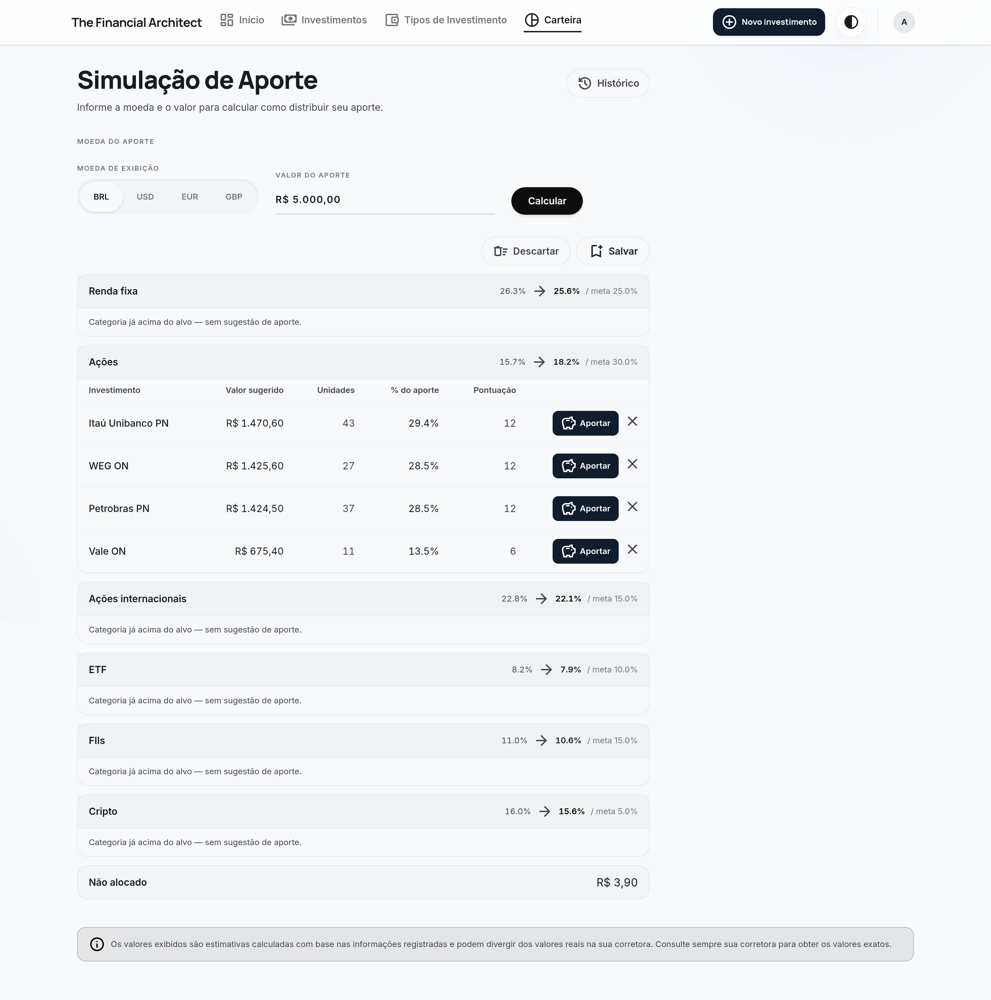

What makes it more than a naïve percentage split:

- **Water-filling across categories** — the contribution fills the categories that are
  *furthest below target first*, so your allocation gaps equalize instead of every
  category getting a flat proportional slice.
- **Whole-unit reality** — you can't buy 1.97 shares of a fund. Each suggestion is
  rounded down to whole units, and the **suggested value is `units × unit price`** — no
  inflated numbers you can't actually execute.
- **Residual redistribution** — the leftover from rounding is redeployed to buy
  additional whole units elsewhere (cross-category, worst-deficit first), with fixed
  income absorbing the remainder fractionally while it's still under target. Whatever
  genuinely can't be deployed shows transparently as **"Não alocado"** (here: just
  R$ 3,90 of a R$ 5.000 contribution).
- **Per-category projection** — every row shows `current% → projected% / target%`, so
  you see the effect of the contribution before committing.
- **One-click apply** — "Aportar" launches the position with the suggested quantity and
  live price; applied rows are marked so you can work down the list.

### Save & revisit — contribution history

Any simulation can be saved as a **read-only snapshot** — exact prices, units and
percentages frozen at the moment you ran it — for future reference.

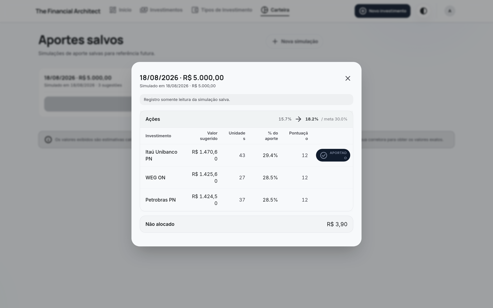

---

## Portfolio & allocation

Set a target percentage for each asset class and the app continuously measures how far
reality has drifted from the plan.

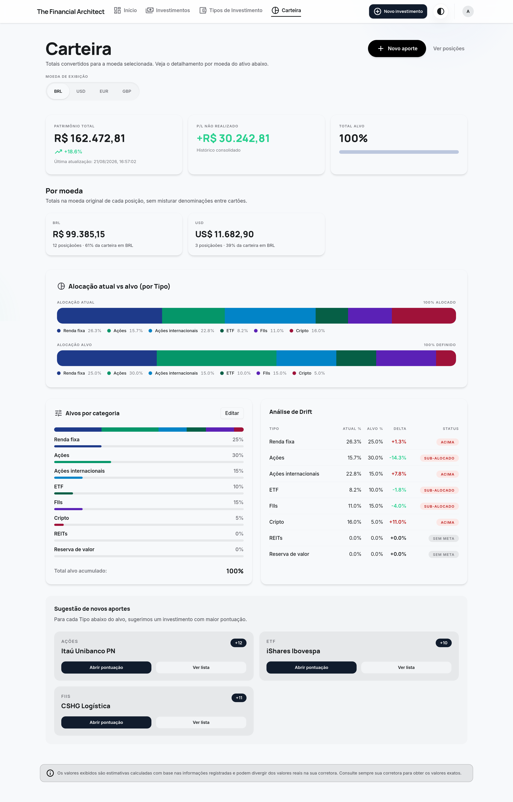

- **Patrimônio total** with total unrealized P/L, plus a per-currency breakdown.
- **Allocation actual vs target** as stacked bars and a donut, category by category.
- **Drift analysis** table: current %, target %, delta, and an at-a-glance
  *over / under-allocated* status per category.
- **Suggested next contributions** surface the highest-scoring investment inside each
  under-target category.

---

## Live holdings

Every position, valued live and converted to your display currency.

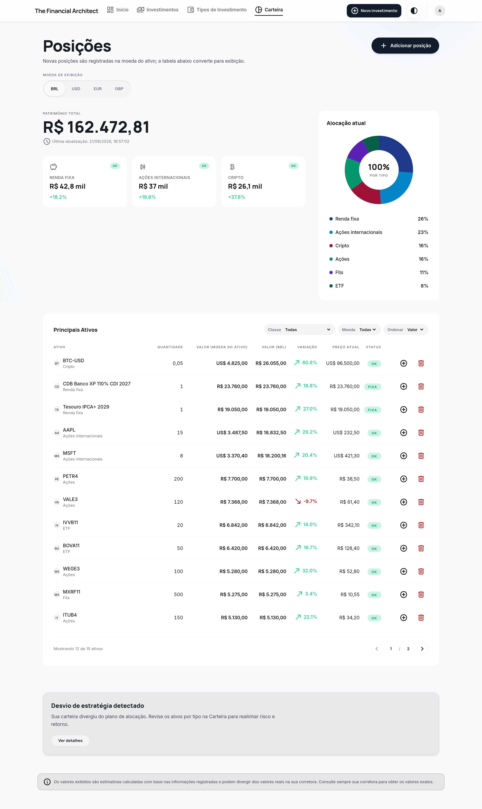

- Positions in **BRL, USD and EUR**, each shown in its native currency *and* converted.
- Live price, daily-style variation vs average cost, and quote status per asset.
- A donut of current allocation by type, and a **"strategy drift detected"** nudge when
  the portfolio wanders from plan.
- Filter by class / currency and sort by value — fixed income, stocks, FIIs, ETFs and
  crypto all in one table.

---

## Investment quality scoring

Each asset class has its own questionnaire (e.g. *"ROE consistently above 5%?"*,
*"Net-debt/EBITDA below 2×?"*, *"Market leader in its sector?"*). Answering yes/no
produces a score that is **comparable within the class** and drives a ranking.

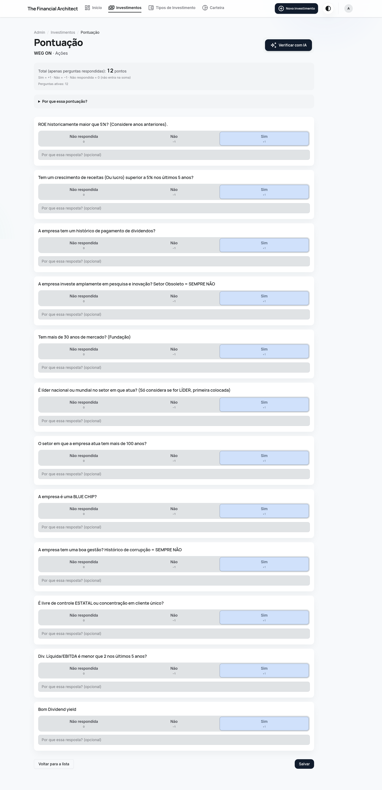

The list-and-ranking view compares every investment inside its category, showing points,
answered/active questions, and rank:

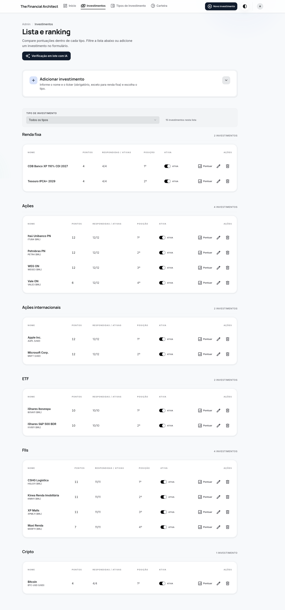

---

## AI-assisted analysis

Don't want to answer 12 questions per stock by hand? Bring your own **Claude (Anthropic)**
API key and let the app answer the checklist for you — from company fundamentals and, when
needed, live web search — then review and apply the suggestions.

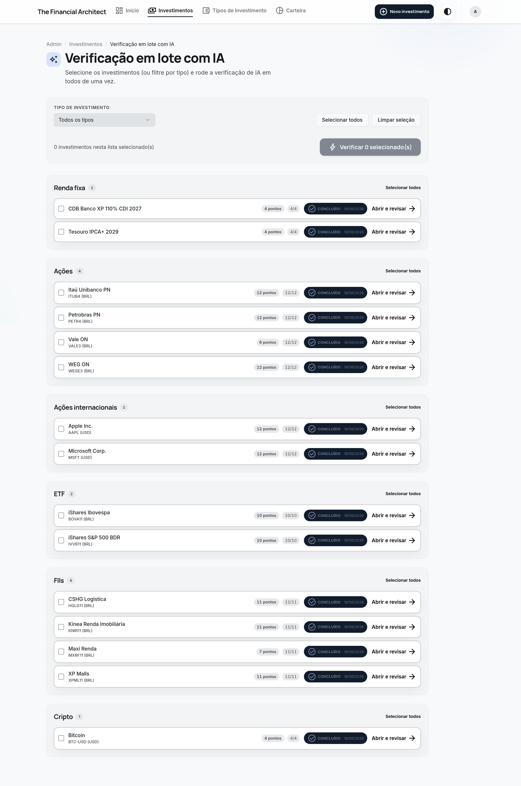

Run it one investment at a time, or **in batch** across a whole category. API keys are
stored **encrypted at rest (AES-256-GCM)**.

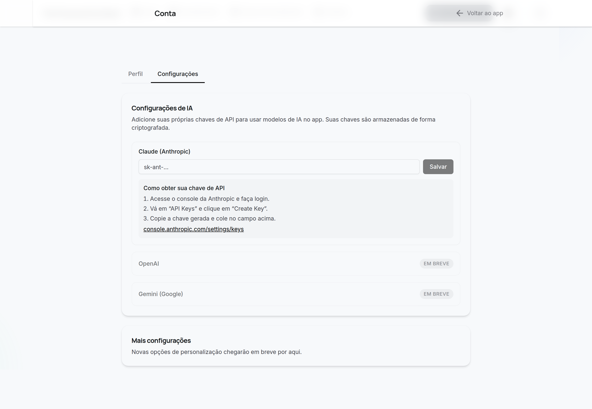

---

## Configurable categories & questionnaires

Nothing is hard-coded. You own your asset classes, their display order, whether they're
fixed income, and the questionnaire behind each one.

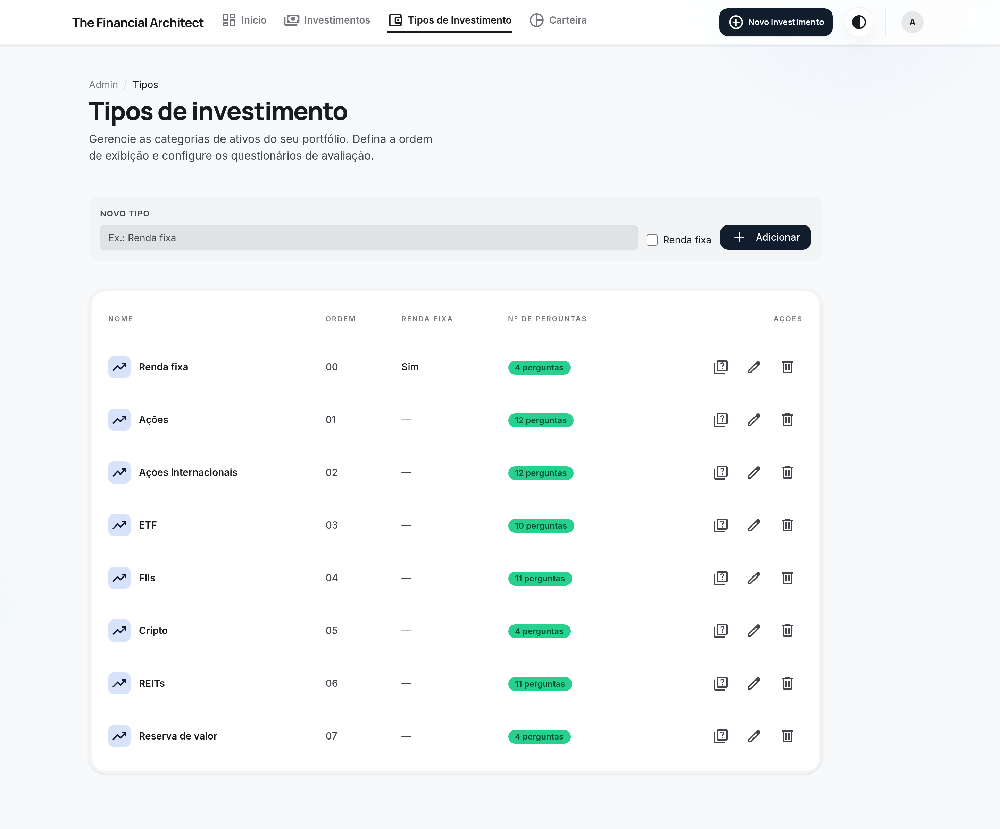

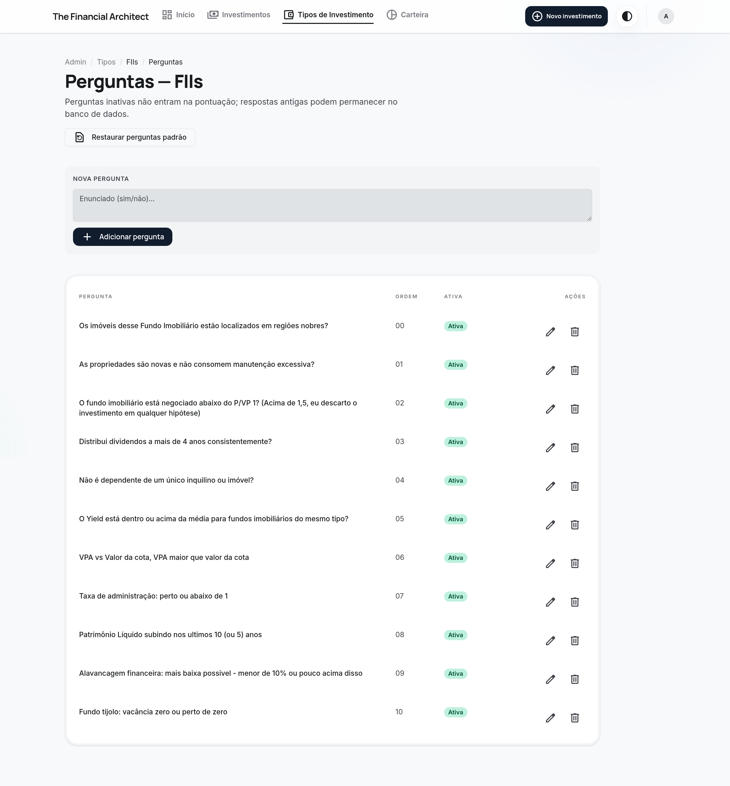

---

## Built for mobile

The whole app is responsive — a dedicated bottom navigation bar, single-column cards,
and full feature parity on a phone.

| Dashboard | Holdings | Contribution | Allocation |
|---|---|---|---|
| 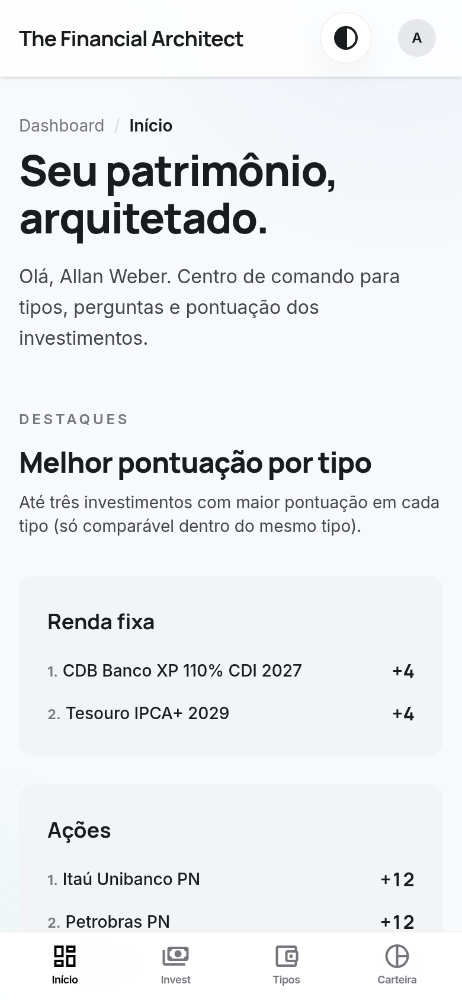 | 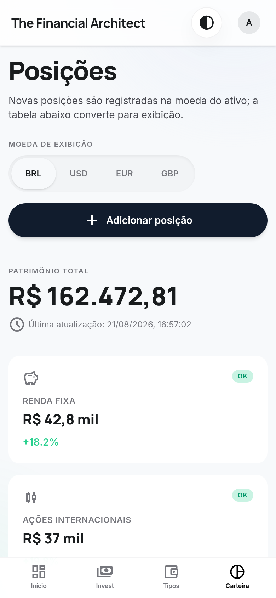 | 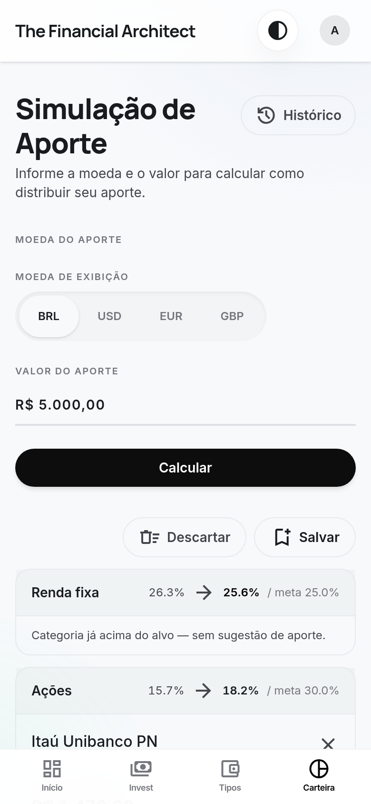 | 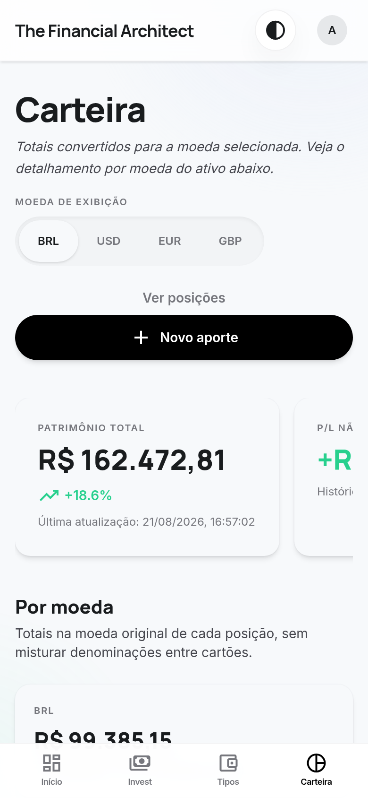 |

---

## Authentication & account

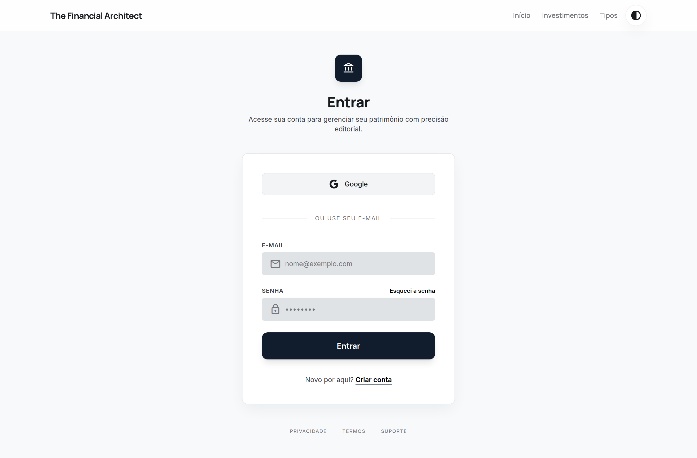

- **Better Auth** with email + password, **email-OTP verification**, and **Google SSO**.
- Password reset, email verification, and an admin role with optional IP allow-listing.
- The dashboard greets you with a per-category "best score" leaderboard:

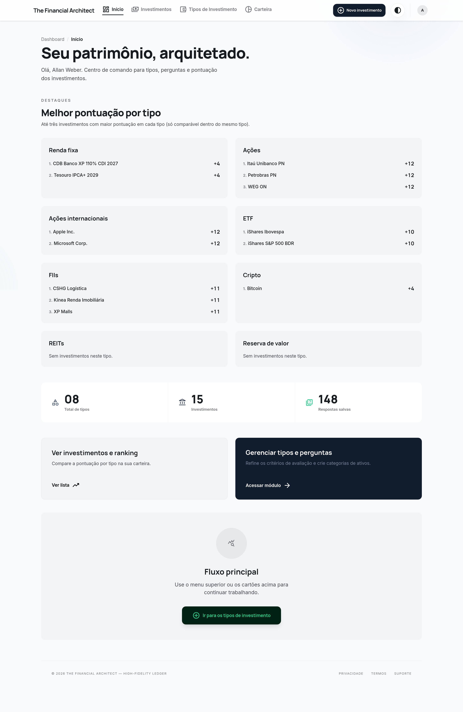

---

## Tech stack

| Layer | Technology |
|---|---|
| **Framework** | TanStack Start (SSR) · TanStack Router (file-based) · React 19 |
| **Server logic** | Type-safe server functions · Nitro |
| **Database** | PostgreSQL · Drizzle ORM (typed schema + migrations) |
| **Auth** | Better Auth (email/password, OTP, Google OAuth, admin) |
| **Market data** | yahoo-finance2 + brapi (quotes) · BCB (CDI/Selic/IPCA) · background refresh worker |
| **Styling** | Tailwind CSS v4 · Material-3 design tokens · light/dark |
| **AI** | Anthropic Claude SDK (bring-your-own-key, encrypted) |
| **Validation** | Zod |
| **Testing** | Vitest (unit + domain logic) |
| **Delivery** | Docker (web + quote worker), single-image or split services |

---

## Engineering highlights

- **A real allocation algorithm.** The contribution engine is a water-filling optimizer
  over integer units: it distributes across categories by deficit, floors each holding to
  whole tradable units, then greedily redeploys the rounding residual worst-deficit-first
  across categories — with fixed income and crypto absorbing fractionally, but only while
  under target. Fully covered by unit tests.
- **Multi-currency correctness.** A dedicated FX layer converts native → display currency
  with a cached rate matrix, and the valuation pipeline keeps native and display figures
  distinct end-to-end.
- **Fixed income as a first-class asset.** CDB/Tesouro positions are valued with real
  indexers (CDI, Selic, IPCA, IGP-M), computing gross vs net return with IR and IOF and a
  liquidity model — not just "cost = value".
- **Market data as a cache, not a dependency.** Screens read a `market_quote` / `fx_rate`
  cache; a background worker refreshes it, so page loads never block on a provider.
- **SSR-safe by construction.** Server-only modules (DB, auth) are isolated from the
  client bundle via the router's server-function boundaries and a build-time DB client stub.
- **Type-safe from schema to UI.** Drizzle's schema types flow through server functions
  into the React components, so a column rename is a compile error, not a runtime surprise.

---

Screenshots captured from the running application against a representative demo
portfolio. The UI is Brazilian Portuguese; this document is in English for a general
audience.
